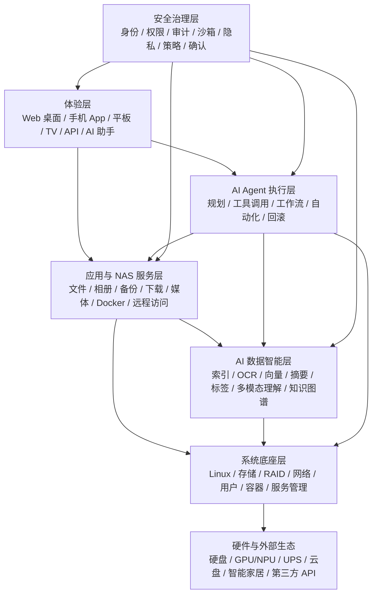
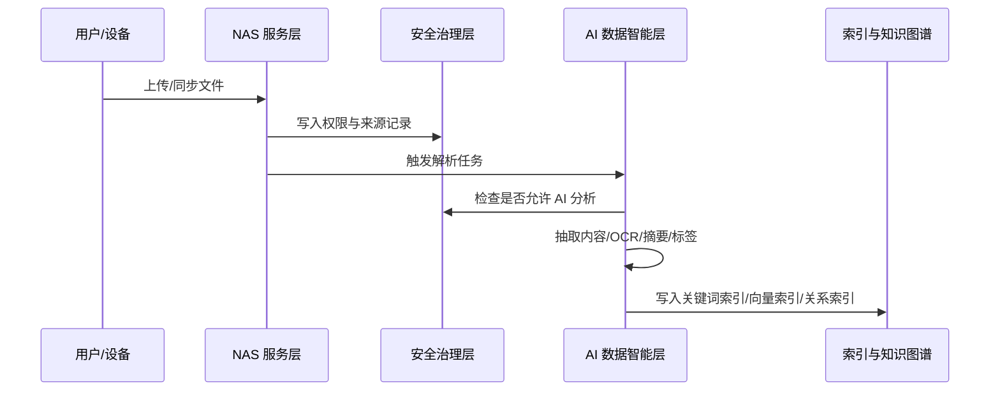
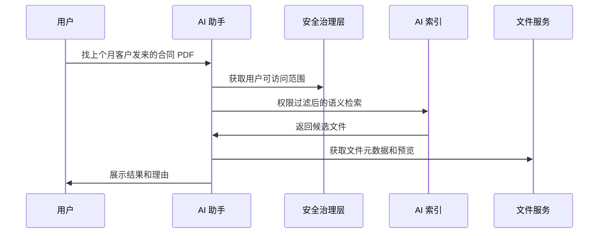
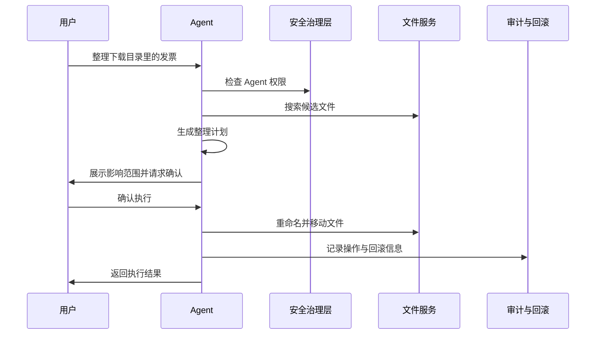

# HiGoOS AI NAS 完整产品架构设计

日期：2026-05-05

## 1. 产品定义

HiGoOS 是一款 AI 原生 NAS 操作系统。它不是传统 NAS 外挂 AI 应用，而是把 AI 数据理解、AI Agent 执行、文件治理、生活助手和系统安全治理放进操作系统架构中。

HiGoOS 首先必须是一套完整 NAS 系统，覆盖存储、文件、权限、共享、备份、相册、媒体、下载、应用中心、容器、远程访问、系统监控和安全审计。在此基础上，HiGoOS 通过统一的 AI 数据智能层理解用户授权范围内的文件、相册、设备状态、备份历史、应用状态和家庭/团队知识，再由 AI Agent 执行层完成可控的自动化任务。

核心原则：

- NAS 负责可信存储。
- AI 负责理解、建议和执行。
- 所有 AI 行为必须受权限、确认、审计、沙箱和回滚机制约束。
- 系统应同时服务家庭、个人创作者和小团队，但完整架构不按版本裁剪。
- 默认体验要易用，底层能力要专业，AI 能力要系统级统一。

## 2. 总体架构

HiGoOS 的完整架构由七个核心部分组成：

1. 系统底座层：提供真实 OS、存储、网络、用户、服务和硬件管理能力。
2. NAS 服务层：覆盖传统 NAS 所有核心功能。
3. AI 数据智能层：理解文件、媒体、知识和设备状态。
4. AI Agent 执行层：规划和执行跨系统任务。
5. 安全治理层：横向约束所有访问、模型调用和执行动作。
6. 多端体验层：提供 Web 桌面、手机、平板、TV、API 和助手入口。
7. 应用与生态层：支持应用、插件、模型供应商、Agent 模板和第三方集成。

## 3. 系统底座层

系统底座层是 HiGoOS 的运行根基，目标是稳定、可维护、可观测、可扩展。

职责范围：

- Linux 系统内核、系统服务、驱动和硬件识别。
- 磁盘管理、文件系统、存储池、RAID、卷管理、快照基础能力。
- 用户、用户组、角色、文件 ACL、共享协议权限。
- 网络配置、DNS、DDNS、反向代理、内网穿透、远程访问通道。
- 容器运行时、Docker Compose、应用隔离、端口管理和资源限制。
- 系统服务管理、计划任务、事件总线、日志收集、告警系统。
- GPU、NPU、CPU 推理资源识别与调度。
- UPS、电源、风扇、温度、硬盘健康、坏盘预警。

底座层不直接承载复杂产品体验，而是为 NAS 服务层、AI 数据层和 Agent 执行层提供可靠能力。

## 4. NAS 核心服务层

NAS 核心服务层是 HiGoOS 的可信基础。AI 能力不能替代这些能力，而要增强它们。

### 4.1 文件管理中心

- 个人空间、家庭空间、团队空间、共享文件夹。
- 文件夹树、列表、网格、预览、收藏、标签、最近访问。
- 上传、下载、移动、复制、重命名、删除、批量操作。
- 回收站、版本历史、文件恢复。
- 外链分享、访问密码、有效期、下载次数限制。
- WebDAV、SMB、NFS、AFP 等共享协议管理。

### 4.2 存储管理中心

- 硬盘识别、硬盘槽位、容量、温度、SMART 状态。
- 存储池、卷、RAID 0/1/5/6/10、热备盘。
- 快照、容量趋势、空间预警、坏盘预警。
- 文件系统检查、阵列重建、迁移和扩容。

### 4.3 用户与权限中心

- 家庭成员、团队成员、访客、管理员。
- 用户组、角色、文件夹 ACL、应用权限。
- 设备绑定、多端登录、会话管理。
- 分享权限、外链权限、审计日志。

### 4.4 备份同步中心

- 手机相册备份。
- 电脑文件备份。
- 云盘同步。
- 异地 NAS 备份。
- 快照和恢复点。
- 备份计划、失败重试、完整性校验。

### 4.5 相册与媒体中心

- 照片、视频、音乐管理。
- 时间线、人物、地点、设备、相册。
- 家庭相册、共享相册、智能回忆。
- 媒体刮削、海报墙、字幕、转码。

### 4.6 下载中心

- BT、HTTP、磁力链接、订阅下载。
- 下载队列、限速、分类、完成后处理。
- 与文件管家联动自动归档。

### 4.7 应用中心

- 官方应用、社区插件、Docker 应用。
- 应用安装、更新、卸载、权限声明。
- 端口、存储路径、环境变量、资源限制管理。

### 4.8 远程访问中心

- 设备绑定、远程域名、内网穿透。
- 访问策略、异地登录提醒、多因素认证。
- 分享链接安全检查。

### 4.9 设备监控中心

- CPU、内存、网络、磁盘、温度、风扇。
- 容器、应用、任务、备份、下载状态。
- 系统日志、告警、性能趋势。

## 5. AI 数据智能层

AI 数据智能层是 HiGoOS 的核心差异。它负责把 NAS 中的数据变成可理解、可检索、可问答、可执行的智能上下文。

### 5.1 数据接入

数据来源包括：

- 文件系统元数据：名称、路径、类型、大小、创建时间、修改时间、访问记录。
- 文档内容：PDF、Word、Excel、PowerPoint、Markdown、TXT、HTML、代码文件。
- 图片内容：照片、截图、扫描件、票据、证件、白板。
- 视频内容：关键帧、字幕、音轨、场景。
- 音频内容：转写、说话人、摘要。
- 系统数据：备份历史、硬盘状态、应用状态、任务状态、日志。
- 外部数据：云盘、智能家居、第三方 API、用户授权服务。

### 5.2 内容理解

- 文件解析与正文抽取。
- OCR 与版面识别。
- 图片场景识别、人物识别、物体识别。
- 视频关键帧理解和音频转写。
- 文档摘要、文件夹摘要、项目摘要。
- 实体识别：人物、地点、客户、项目、设备、日期、金额。
- 自动标签：主题、事件、类型、风险、用途。

### 5.3 索引体系

HiGoOS 需要同时维护多种索引：

- 关键词索引：用于精确搜索。
- 元数据索引：用于筛选、排序、统计。
- 向量索引：用于语义搜索和相似内容发现。
- 多模态索引：用于图片、视频、音频和文档跨模态检索。
- 权限索引：确保搜索和问答结果只返回用户有权访问的数据。
- 关系索引：连接文件、人物、项目、设备、任务和事件。

### 5.4 知识图谱

知识图谱用于表达文件之间的关系：

- 某合同属于哪个客户和项目。
- 某发票对应哪个订单或月份。
- 某相册属于哪次旅行和哪些家庭成员。
- 某备份任务保护哪些目录和设备。
- 某 Agent 规则影响哪些文件夹。

知识图谱不替代文件系统，而是为问答、推荐、归档和 Agent 执行提供上下文。

### 5.5 模型策略

HiGoOS 采用企业可配置 AI 模式：

- 家庭默认混合模式：本地处理隐私索引和基础理解，复杂推理可选云模型。
- 小团队可配置供应商：允许指定 OpenAI、私有模型、局域网模型或其他供应商。
- 企业可强制本地：禁用云模型，所有数据处理在本地或私有化环境完成。
- 按数据级别路由：敏感数据只允许本地模型，普通数据可走云端增强。
- 按任务类型路由：OCR、转写、摘要、问答、Agent 规划可选择不同模型。

## 6. AI Agent 执行层

AI Agent 执行层是 HiGoOS 的自动化大脑。它不只是聊天入口，而是具备系统工具调用能力的任务执行平台。

### 6.1 Agent 能力模型

每个 Agent 由以下部分组成：

- 身份：Agent 名称、用途、所属用户或空间。
- 能力声明：可访问哪些工具、哪些数据、哪些系统服务。
- 权限范围：可读、可写、可分享、可删除、可修改权限。
- 触发方式：用户对话、定时、事件、规则、API。
- 执行策略：只建议、需确认、半自动、全自动。
- 风险级别：低风险、中风险、高风险。
- 审计记录：输入、计划、工具调用、结果、影响范围。
- 回滚方式：移动、重命名、归档、删除、权限修改等操作的撤销策略。

### 6.2 系统工具

Agent 可调用的工具必须由 HiGoOS 显式注册和授权：

- 文件搜索、读取、摘要、复制、移动、重命名、删除、恢复。
- 文件夹创建、标签管理、收藏管理、分享链接管理。
- 备份任务创建、暂停、恢复、校验、恢复。
- 相册创建、照片筛选、人物合并、回忆生成。
- 下载任务创建、暂停、分类、完成后归档。
- Docker 应用状态查看、重启、资源统计。
- 系统状态查看、告警创建、通知发送。
- 外部 API 调用、Webhook 调用、智能家居动作。

### 6.3 工作流引擎

工作流支持：

- 定时触发：每天、每周、每月。
- 事件触发：新文件上传、备份失败、空间不足、硬盘异常、照片导入。
- 条件判断：文件类型、目录、标签、大小、日期、权限、风险等级。
- 多步骤任务：搜索、分析、建议、确认、执行、记录。
- 人工确认节点：高风险操作必须停下来等待用户确认。
- 失败处理：重试、回滚、通知、降级执行。

### 6.4 多 Agent 协作

HiGoOS 可以内置多个系统 Agent：

- 文件管家 Agent：整理、命名、归档、清理。
- 相册管家 Agent：筛选、分类、回忆、分享。
- 家庭助手 Agent：家庭资料问答、提醒、生活任务。
- 项目资料 Agent：项目文件总结、会议资料整理、资料包生成。
- 财务票据 Agent：发票、合同、收据识别和归档。
- 设备运维 Agent：空间、硬盘、备份、容器异常处理。

多个 Agent 可以协同，但必须由权限治理系统约束。

## 7. AI 文件管家

AI 文件管家是 HiGoOS 的系统级文件治理应用，也是 AI Agent 的重点落地场景。

核心能力：

- 自动分类：按项目、客户、日期、类型、来源、人物、地点分类。
- 自动命名：票据、合同、扫描件、截图、会议资料按规则命名。
- 自动归档：下载目录、相册导入目录、扫描件目录、聊天文件目录。
- 重复识别：完全重复、相似文件、旧版本、重复照片。
- 空间治理：大文件、长期未访问文件、可压缩文件、可删除缓存。
- 备份建议：发现未备份目录、异常备份间隔、重要文件无快照。
- 权限提醒：危险外链、过期分享、异常公开文件夹。
- 文件夹健康度：混乱程度、重复占用、未归档、风险文件。

交互原则：

- 默认给建议，不直接改动重要文件。
- 用户可以创建授权规则让管家自动执行。
- 每次批量动作都要显示影响范围。
- 所有移动、重命名、归档、删除动作都可审计和撤销。

## 8. AI 生活助手

AI 生活助手面向家庭和个人用户，将 NAS 中的家庭资料、照片、设备状态和提醒能力组织成自然语言体验。

核心能力：

- 家庭知识库：合同、保修单、说明书、证件、医疗记录、宠物资料。
- 家庭资料问答：例如“空调遥控器说明书在哪”“去年体检报告是哪份”。
- 照片回忆：旅行、生日、儿童成长、节日、宠物、家庭聚会。
- 生活提醒：保修到期、证件过期、备份失败、硬盘风险、空间不足。
- 家庭任务：整理照片、生成分享链接、准备资料包。
- 家庭成员权限：不同成员看到不同资料，儿童和访客有独立限制。
- 智能家居预留：设备状态、家庭场景、自动化联动。

生活助手必须尊重权限边界。它可以帮助家庭成员找到资料，但不能把受限资料暴露给无权限成员。

## 9. 安全治理层

安全治理层横贯整个 HiGoOS，是 AI 原生 NAS 能否可信的关键。

### 9.1 身份与权限

- 用户身份、设备身份、会话身份。
- 管理员、家庭成员、团队成员、访客、应用、Agent。
- 用户组、角色、空间权限、文件夹 ACL。
- 应用权限和 Agent 权限统一管理。

### 9.2 AI 数据访问控制

- AI 只能索引和回答用户有权访问的数据。
- 向量索引、摘要、标签也必须绑定权限。
- 文件权限变化后，AI 索引可见性必须同步变化。
- 敏感文件可设置不进入 AI 分析。

### 9.3 风险分级

低风险动作：

- 搜索、摘要、分类建议、只读问答。

中风险动作：

- 移动、重命名、批量打标签、创建分享链接。

高风险动作：

- 删除、覆盖、公开分享、权限变更、外部 API 发送敏感数据、关闭备份。

中高风险动作必须支持确认、审计和回滚。

### 9.4 审计与回滚

审计记录应包含：

- 谁发起任务。
- 哪个 Agent 执行。
- 使用了哪些工具。
- 读取了哪些数据范围。
- 修改了哪些文件或设置。
- 为什么执行该步骤。
- 是否经过用户确认。
- 如何撤销。

回滚应覆盖：

- 文件移动。
- 文件重命名。
- 标签变更。
- 归档规则执行。
- 分享链接创建。
- 权限修改。
- 删除恢复。

### 9.5 隐私与模型治理

- 本地模型、私有模型、云模型可配置。
- 敏感数据可禁止云端处理。
- 模型调用记录可审计。
- 用户可查看哪些文件进入过 AI 分析。
- 管理员可设定空间级和用户级 AI 策略。

## 10. 多端体验层

HiGoOS 不应把同一个界面强行适配所有终端，而要为不同场景设计不同入口。

### 10.1 Web 桌面系统

Web 桌面是 HiGoOS 的主控台：

- 桌面、窗口、多任务、应用图标、系统托盘。
- 文件管理器、存储管理、备份中心、应用中心、控制中心。
- AI 助手常驻侧边栏。
- 通知中心聚合系统、备份、Agent 和生活提醒。
- 支持拖拽、右键菜单、多窗口、批量操作。

### 10.2 手机 App

手机端强调随时访问和轻量管理：

- 照片和视频自动备份。
- 远程文件访问、预览、分享。
- NAS 健康状态和通知。
- AI 助手对话。
- 快速查找家庭资料。
- 备份、下载、分享、设备告警的快速处理。

### 10.3 平板端

平板端适合轻办公和家庭资料整理：

- 双栏文件管理。
- 相册整理。
- 文档预览和问答。
- Agent 任务审阅。

### 10.4 TV 端

TV 端聚焦媒体消费：

- 家庭相册。
- 视频、音乐、电影库。
- AI 回忆相册。
- 大屏播放和家庭展示。

### 10.5 API 与开发者入口

- REST API / WebSocket。
- Webhook。
- 插件 SDK。
- Agent 工具注册。
- 应用权限声明。

## 11. 应用与生态层

HiGoOS 需要成为可扩展的平台，而不是封闭产品。

生态组成：

- 官方应用中心。
- Docker 应用市场。
- 插件系统。
- Agent 模板市场。
- 工作流模板市场。
- 模型供应商接入。
- 云盘接入。
- 智能家居接入。
- 开发者 SDK。

扩展原则：

- 第三方应用必须声明权限。
- 第三方 Agent 必须声明工具、数据范围和风险等级。
- 用户可以随时撤销应用和 Agent 权限。
- 应用数据和系统数据需要边界清晰。
- 插件不能绕过安全治理层直接访问敏感文件。

## 12. 核心数据流

### 12.1 文件进入系统

### 12.2 用户自然语言查找文件

### 12.3 Agent 执行整理任务

## 13. 页面与入口结构

HiGoOS 的主入口不应只有控制台，还需要围绕 AI 原生体验组织。

### 13.1 Web 桌面应用

- 文件管理
- 存储管理
- 用户权限
- 备份同步
- 相册媒体
- 下载中心
- 应用中心
- Docker
- 设备监控
- 远程访问
- AI 助手
- AI 文件管家
- Agent 工作台
- 生活助手
- 安全中心
- 系统设置

### 13.2 手机 App 入口

- 首页
- 文件
- 相册
- AI 助手
- 通知
- 设备
- 备份
- 分享
- 我的

### 13.3 AI 入口

- 全局 AI 助手：任何页面都能唤起。
- 文件夹 AI：针对当前文件夹问答、摘要、整理。
- 文件 AI：针对单个文件摘要、问答、提取信息。
- Agent 工作台：创建、授权、运行和审计 Agent。
- 文件管家：查看建议、规则、自动整理记录。
- 生活助手：家庭资料、照片回忆、提醒和任务。

## 14. 模块边界

为了避免系统失控，HiGoOS 需要清晰模块边界：

- 文件系统是事实来源，AI 索引是派生数据。
- 权限系统是唯一访问裁决来源，AI 不拥有绕过权限的特权。
- Agent 不能直接操作底层文件系统，只能调用已授权工具。
- 应用和插件必须通过应用权限层访问系统能力。
- 审计系统记录所有跨边界动作。
- 模型调用服务统一处理本地、私有和云模型策略。

## 15. 非功能要求

### 15.1 稳定性

- NAS 基础服务必须独立于 AI 服务运行。
- AI 服务故障不能影响文件访问、备份和存储安全。
- 索引任务应可暂停、恢复、重建。

### 15.2 性能

- 文件索引应异步执行。
- 大文件解析应排队和限流。
- 向量索引应按空间和权限分区。
- 手机端接口要优先返回轻量状态。

### 15.3 可观测性

- 系统日志。
- AI 解析日志。
- Agent 执行日志。
- 模型调用日志。
- 备份和存储健康日志。

### 15.4 可维护性

- NAS 服务、AI 服务、Agent 服务、安全治理服务需要模块化。
- 插件和应用不能破坏系统核心。
- 数据迁移、索引重建和配置导出必须可控。

## 16. 成功标准

HiGoOS 的完整架构成功标准：

- 用户能把它当作完整 NAS 使用，而不是 AI 玩具。
- 用户能用自然语言理解和操作自己的文件。
- AI 能主动协助整理、备份、提醒和自动化，但不会越权。
- 管理员能清楚知道 AI 访问了什么、做了什么、为什么做。
- 家庭用户能通过生活助手感知价值。
- 专业用户能通过 Agent 平台构建自动化。
- 小团队能通过权限、审计和模型策略安全使用。
- 开发者能通过插件、应用和 Agent 工具扩展生态。

## 17. 设计结论

HiGoOS 的完整定义是：

**HiGoOS = 完整 NAS 系统底座 + 全量 NAS 服务 + AI 数据智能层 + AI Agent 自动化执行层 + 安全治理层 + 多端体验 + 应用生态。**

它的核心差异不是“有 AI 聊天框”，而是让 NAS 中的数据、设备、任务和家庭/团队知识都进入一个受权限治理的智能操作系统中。AI 可以理解数据，也可以执行任务，但每一步都必须可授权、可解释、可审计、可撤销。
